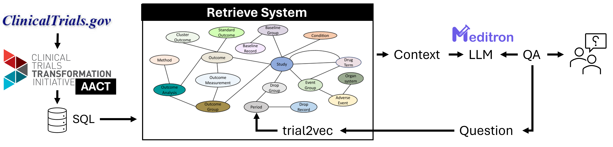

# Retrieval Augmented Generation (RAG) system for ClinicalTrials.gov

## Summary
Clinical Trials (CTs) constitute a cornerstone of medical research, providing critical evidence for evaluating the safety and efficacy of new treatments and interventions. With the average cost of a single phase in CTs ranging from 1.4 million to 52.9 million US dollars, there is a pressing need for innovative approaches to maximize the utility of trial data. However, despite their importance, the complexity and volume of CT data present significant challenges for efficient analysis and interpretation.

This project combines a Knowledge Graph (KG) with a Large Language Model (LLM) in a Retrieval Augmented Generation (RAG) system to overcome the challenges in analyzing and interpreting Clinical Trials (CTs) data.

Figure: The Retrieval Augmented Generation (RAG) system for ClinicalTrials.gov

The proposed querying framework aims to enable researchers to streamline analysis tasks such as identifying trends in CTs related to specific diseases. This integration maximizes the utility of CT data, facilitating more efficient analysis, interpretation, and utilization, ultimately advancing medical research progress.

## Aims:
1.	Create a tool that enables medical researchers to analyse large and complex datasets of clinical trial protocols using natural language. 
2.	Evaluate the feasibility of utilizing Large Language Models (LLMs) for analysing and querying clinical trial protocols and results  from clinicalTrials.gov
3.	Assess the effectiveness of Knowledge Graph – Retrieve Augmented Generation (KG-RAG)  on clinical trial studies to enhance LLMs querying and analysing capabilities.

## Features:
- text-2-SQL system for AACT.
- ctGov Knowledge Graph.
- Retrieval Augmented Generation using Meditron-7B

## Evaluation / Use Cases:
- Respond to specific questions regarding a single clinical trial protocol or condition or intervention.
- Patient - CT matching. Given a patient note identify CT studies where the patient would be eligible for enrollment.

## References:
[1] Jin, Qiao, et al. "Matching patients to clinical trials with large language models." ArXiv (2023).\
[2] Lobentanzer, Sebastian, et al. "Democratizing knowledge representation with BioCypher." Nature Biotechnology 41.8 (2023): 1056-1059.
